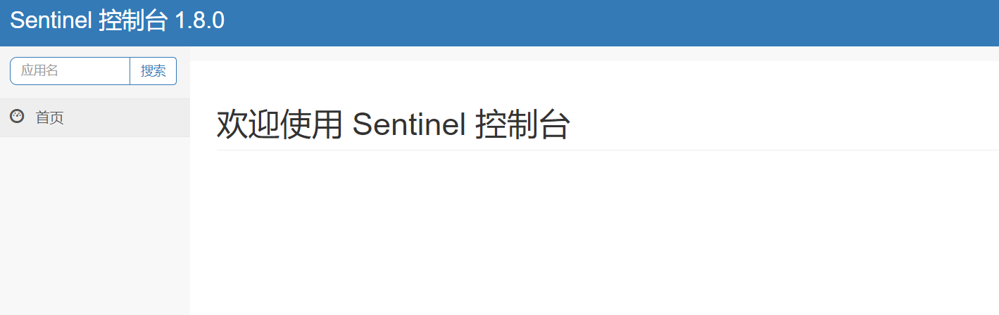

# Sentinel 控制台

## 0. 概述

Sentinel 控制台是流量控制、熔断降级规则统一配置和管理的入口，它为用户提供了机器自发现、簇点链路自发现、监控、规则配置等功能。在 Sentinel
控制台上，我们可以配置规则并实时查看流量控制效果。<br>
[Github地址-Nacos实现](https://github.com/CHENZHENNAME/sentinel-dashboard-nacos) <br>
[Apollo实现](https://github.com/hosaos/apollo-sentinel-dashboard)  <br>

## 1. K8S启动

### 1.1 cicd集成自动打包，镜像参考``dockerfile``文件定义

### 1.2 自动发布，参考``deployment.yaml``文件定义

### 1.3 doceker启动相关变量参数说明

| 变量 | 说明 |
|---|---|
|NACOS_SERVER_ADDR| nacos服务地址|
|NACOS_NAMESPACE| nacos域名空间 |
|NACOS_USERNAME| nacos用户 |
|NACOS_PASSWORD| nacos密码 |
|NACOS_GROUP| nacos默认的分组，默认值``DEFAULT_GROUP`` |
|SERVER_PORT| 控制台端口，默认值``7779``，客户端连接 |
|SENTINEL_USERNAME| dashboard登录账号，默认值``sentinel``|
|SENTINEL_PASSWORD| dashboard登录密码，默认值``sentinel``|

### 1.3 启动后相关效果
默认账号密码：sentinel/sentinel

## 2. 改造简述

1. 结合nacos持久规则，使用推拉模式更新客户端规则，主要改造点参考``com.alibaba.csp.sentinel.dashboard.rule.nacos``包下
2. 改造监控数据持久化-(待完成) <br>
   [msyql改造](https://cloud.tencent.com/developer/article/1655863)
   [influxdb](https://blog.csdn.net/weixin_30721899/article/details/101641467)
3. 服务启动，默认端口：7779，可通过指定参数更改端口：``-Dserver.port=8888``
4. nacos相关配置，通过容器启动变量更改，主要变量：``NACOS_SERVER_ADDR``、``NACOS_NAMESPACE``，详情参考application.properties文件

## 3. 客户端接入使用

### 1. spring-cloud-alibaba-dependencies组件升级到``2.2.3.RELEASE``，适配dashboard的1.8.0版本

### 2. 网关接入(一定要核对版本号1.8.0)

#### 1. pom引入

```xml 
   <dependency>
      <groupId>org.springframework.cloud</groupId>
      <artifactId>spring-cloud-starter-gateway</artifactId>
    </dependency>
    <dependency>
      <groupId>org.springframework.cloud</groupId>
      <artifactId>spring-cloud-loadbalancer</artifactId>
    </dependency>

    <dependency>
      <groupId>com.alibaba.cloud</groupId>
      <artifactId>spring-cloud-starter-alibaba-nacos-discovery</artifactId>
    </dependency>
    <dependency>
      <groupId>com.alibaba.cloud</groupId>
      <artifactId>spring-cloud-starter-alibaba-nacos-config</artifactId>
    </dependency>
    <dependency>
      <groupId>com.alibaba.cloud</groupId>
      <artifactId>spring-cloud-alibaba-sentinel-gateway</artifactId>
    </dependency>
    <dependency>
      <groupId>com.alibaba.cloud</groupId>
      <artifactId>spring-cloud-starter-alibaba-sentinel</artifactId>
    </dependency>
    <dependency>
      <groupId>com.alibaba.csp</groupId>
      <artifactId>sentinel-datasource-nacos</artifactId>
    </dependency>
```

#### 2. 网关配置 bootstrap.yml文件，通过容器参数注入

```yaml 
spring:
  main:
    allow-bean-definition-overriding: true
  profiles:
    active: ${SPRING_PROFILES:dev}
  application:
    name: xiao-ms-gateway
  cloud:
    nacos:
      config:
        file-extension: yml
        namespace: ${NACOS_NAMESPACE:43f2c792-77bc-421a-94c5-b847ea10b2df}
      username: ${NACOS_USERNAME:nacos}
      password: ${NACOS_PASSWORD:nacos}
      server-addr: ${NACOS_SERVER_ADDR:http://localhost:8848}
      discovery:
        namespace: ${NACOS_NAMESPACE:43f2c792-77bc-421a-94c5-b847ea10b2df}
        group: ${NACOS_GROUP:DEFAULT_GROUP}
    sentinel:
      transport:
        # dashboard地址
        dashboard: ${SENTINEL_SERVER_ADDR:http://172.16.30.102:7779}
        # dashboard和客户端交互的端口，容器启动需要开放此端口
        port: ${SENTINEL_CLIENT_PORT:8720}
      datasource:
        ## 网关限流规则
        gw-flow:
          nacos:
            server-addr: ${NACOS_SERVER_ADDR:http://localhost:8848}
            # 在修改的sentinel 源码中定义的规则名  com.alibaba.csp.sentinel.dashboard.rule.nacos.NacosConfigUtil
            dataId: ${spring.application.name}-gw-flow-rules
            groupId: ${NACOS_GROUP:DEFAULT_GROUP}
            namespace: ${NACOS_NAMESPACE:f4322550-7c13-4045-86b1-81c98ae1da3c}
            data-type: json
            rule-type: gw-flow
        ## 网关api分组
        gw-api-group:
          nacos:
            server-addr: ${NACOS_SERVER_ADDR:http://localhost:8848}
            # 在修改的sentinel 源码中定义的规则名 com.alibaba.csp.sentinel.dashboard.rule.nacos.NacosConfigUtil
            dataId: ${spring.application.name}-gw-api-group-rules
            groupId: ${NACOS_GROUP:DEFAULT_GROUP}
            namespace: ${NACOS_NAMESPACE:f4322550-7c13-4045-86b1-81c98ae1da3c}
            data-type: json
            rule-type: gw-api-group
        ## 网关系统配置
        gw-system:
          nacos:
            server-addr: ${NACOS_SERVER_ADDR:http://localhost:8848}
            # 在修改的sentinel 源码中定义的规则名 com.alibaba.csp.sentinel.dashboard.rule.nacos.NacosConfigUtil
            dataId: ${spring.application.name}-system-rules
            groupId: ${NACOS_GROUP:DEFAULT_GROUP}
            namespace: ${NACOS_NAMESPACE:f4322550-7c13-4045-86b1-81c98ae1da3c}
            data-type: json
            rule-type: system
```

#### 3. 相关变量说明

| 启动变量名 | 描述 | 备注 |
|---|---|---|
| NACOS_NAMESPACE | nacos命名空间 |  |
| NACOS_PASSWORD | nacos密码 |  |
| NACOS_USERNAME | nacos账号 |  |
| NACOS_SERVER_ADDR | nacos服务地址 |  |
| NACOS_GROUP | nacos分组 | 默认``DEFAULT_GROUP`` |
| SENTINEL_SERVER_ADDR | sentinel控制台地址 |  |
| SENTINEL_CLIENT_PORT | sentinel客户端端口，默认值8720| 容器部署，需要开放此端口用于与控制台交互更新流控规则，容器内部可互通即可 |

#### 4. API分组限流


#### 5. 路由限流


#### 6. 实时流量监控


### 3. 后台服务接入

``跟网关接入类似，建议先做到网关级别的限流，注意dataId的后缀匹配规则，以及限流降级后的处理``